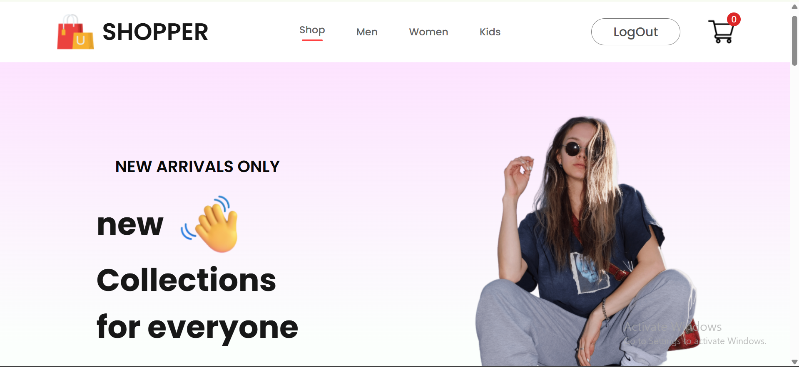

# 🛒 E-Commerce Frontend

### About Project
A responsive, modern frontend for an e-commerce web application, built using **React.js**, **Tailwind CSS**, and  integrated with **Axios** for API communication.

This project connects to a backend server (e.g., [ecommerce-backend](https://github.com/Zartasha-kanwal/ecommerce-backend)) and allows users to browse products, manage a shopping cart, register/login.

---

### 🧪 Tech Stack

- ⚛️ React.js (with functional components & hooks)
- 🎨 Tailwind CSS (utility-first styling)
- 📦 Axios (for API requests)
- 🗃️ React Router DOM (for navigation)

---

### 🚀 Features

✅ Product listing with categories  
✅ Add to cart & cart preview  
✅ User authentication (Login/Register)  
✅ Responsive design for all screen sizes  
✅ Clean UI with Tailwind CSS  
✅ Easy to connect with a Node.js + Express backend  

---

🚀 **Live Demo:**  https://ecommerce-frontend-bice-rho.vercel.app/

### 🛠️ Getting Started

#### 📋 Prerequisites

- Node.js & npm installed
- Backend API ready (e.g., [ecommerce-backend repo](https://github.com/Zartasha-kanwal/ecommerce-backend))

---

#### 🧾 Installation

git clone https://github.com/Zartasha-kanwal/ecommerce-frontend.git
cd ecommerce-frontend
npm install
npm start

